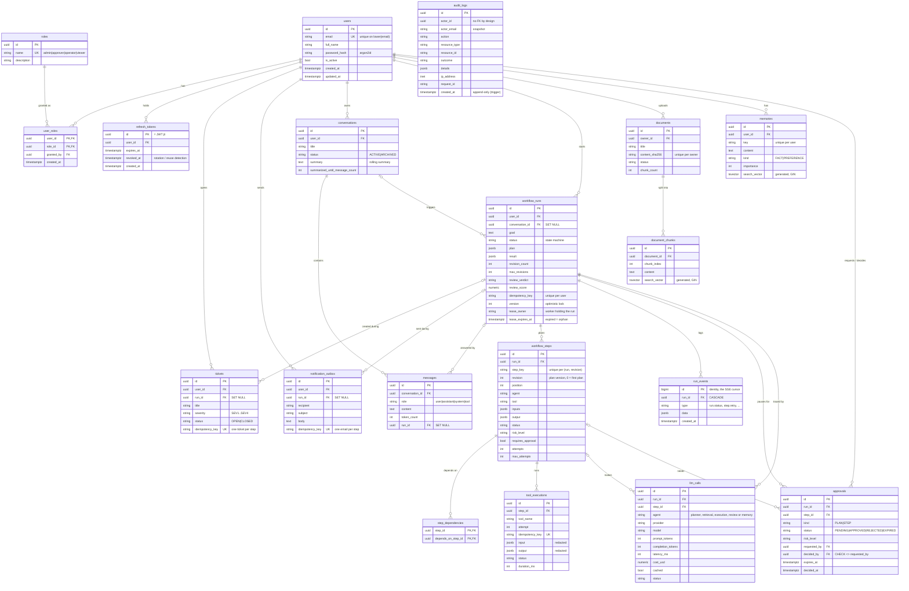

# Database ER Diagram

Renders on GitHub (Mermaid). 18 tables, 3NF, UUID primary keys. Status columns are
`VARCHAR + CHECK` constraints (see `docs/database.md`).

```mermaid
erDiagram
    users ||--o{ user_roles : "has"
    roles ||--o{ user_roles : "granted as"
    users ||--o{ refresh_tokens : "holds"
    users ||--o{ tickets : "opens"
    users ||--o{ notification_outbox : "sends"
    workflow_runs |o--o{ tickets : "created during"
    workflow_runs |o--o{ notification_outbox : "sent during"
    users ||--o{ conversations : "owns"
    users ||--o{ workflow_runs : "starts"
    users ||--o{ documents : "uploads"
    users ||--o{ memories : "has"
    users ||--o{ approvals : "requests / decides"
    conversations ||--o{ messages : "contains"
    conversations |o--o{ workflow_runs : "triggers"
    workflow_runs |o--o{ messages : "answered by"
    workflow_runs ||--o{ workflow_steps : "plans"
    workflow_runs ||--o{ run_events : "logs"
    workflow_runs ||--o{ approvals : "pauses for"
    workflow_runs ||--o{ llm_calls : "traced by"
    workflow_steps ||--o{ step_dependencies : "depends on"
    workflow_steps ||--o{ tool_executions : "runs"
    workflow_steps |o--o{ llm_calls : "makes"
    workflow_steps |o--o{ approvals : "needs"
    documents ||--o{ document_chunks : "split into"

    users {
        uuid id PK
        string email UK "unique on lower(email)"
        string full_name
        string password_hash "argon2id"
        bool is_active
        timestamptz created_at
        timestamptz updated_at
    }
    tickets {
        uuid id PK
        uuid user_id FK
        uuid run_id FK "SET NULL"
        string title
        string severity "SEV1..SEV4"
        string status "OPEN|CLOSED"
        string idempotency_key UK "one ticket per step"
    }
    notification_outbox {
        uuid id PK
        uuid user_id FK
        uuid run_id FK "SET NULL"
        string recipient
        string subject
        text body
        string idempotency_key UK "one email per step"
    }
    refresh_tokens {
        uuid id PK "= JWT jti"
        uuid user_id FK
        timestamptz expires_at
        timestamptz revoked_at "rotation / reuse detection"
        timestamptz created_at
    }
    roles {
        uuid id PK
        string name UK "admin|approver|operator|viewer"
        string description
    }
    user_roles {
        uuid user_id PK,FK
        uuid role_id PK,FK
        uuid granted_by FK
        timestamptz created_at
    }
    conversations {
        uuid id PK
        uuid user_id FK
        string title
        string status "ACTIVE|ARCHIVED"
        text summary "rolling summary"
        int summarized_until_message_count
    }
    messages {
        uuid id PK
        uuid conversation_id FK
        string role "user|assistant|system|tool"
        text content
        int token_count
        uuid run_id FK "SET NULL"
    }
    workflow_runs {
        uuid id PK
        uuid user_id FK
        uuid conversation_id FK "SET NULL"
        text goal
        string status "state machine"
        jsonb plan
        jsonb result
        int revision_count
        int max_revisions
        string review_verdict
        numeric review_score
        string idempotency_key "unique per user"
        int version "optimistic lock"
        string lease_owner "worker holding the run"
        timestamptz lease_expires_at "expired = orphan"
    }
    run_events {
        bigint id PK "identity, the SSE cursor"
        uuid run_id FK "CASCADE"
        string type "run.status, step.retry, ..."
        jsonb data
        timestamptz created_at
    }
    workflow_steps {
        uuid id PK
        uuid run_id FK
        string step_key "unique per (run, revision)"
        int revision "plan version, 0 = first plan"
        int position
        string agent
        string tool
        jsonb inputs
        jsonb output
        string status
        string risk_level
        bool requires_approval
        int attempts
        int max_attempts
    }
    step_dependencies {
        uuid step_id PK,FK
        uuid depends_on_step_id PK,FK
    }
    tool_executions {
        uuid id PK
        uuid step_id FK
        string tool_name
        int attempt
        string idempotency_key UK
        jsonb input "redacted"
        jsonb output "redacted"
        string status
        int duration_ms
    }
    llm_calls {
        uuid id PK
        uuid run_id FK
        uuid step_id FK
        string agent "planner, retrieval, execution, review or memory"
        string provider
        string model
        int prompt_tokens
        int completion_tokens
        int latency_ms
        numeric cost_usd
        bool cached
        string status
    }
    approvals {
        uuid id PK
        uuid run_id FK
        uuid step_id FK
        string kind "PLAN|STEP"
        string status "PENDING|APPROVED|REJECTED|EXPIRED"
        string risk_level
        uuid requested_by FK
        uuid decided_by FK "CHECK <> requested_by"
        timestamptz expires_at
        timestamptz decided_at
    }
    documents {
        uuid id PK
        uuid owner_id FK
        string title
        string content_sha256 "unique per owner"
        string status
        int chunk_count
    }
    document_chunks {
        uuid id PK
        uuid document_id FK
        int chunk_index
        text content
        tsvector search_vector "generated, GIN"
    }
    memories {
        uuid id PK
        uuid user_id FK
        string key "unique per user"
        text content
        string kind "FACT|PREFERENCE"
        int importance
        tsvector search_vector "generated, GIN"
    }
    audit_logs {
        uuid id PK
        uuid actor_id "no FK by design"
        string actor_email "snapshot"
        string action
        string resource_type
        string resource_id
        string outcome
        jsonb details
        inet ip_address
        string request_id
        timestamptz created_at "append-only (trigger)"
    }
```
