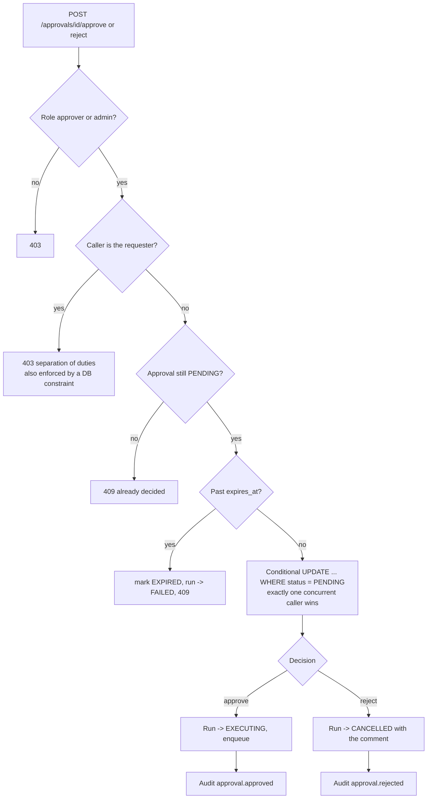

# Flowchart: approval decision

Source: `app/orchestrator/approvals.py` (`ApprovalService.decide`). The checks run in this order.

```mermaid
flowchart TD
    A[POST /approvals/id/approve or reject] --> B{Role approver or admin?}
    B -- no --> X1[403]
    B -- yes --> C{Caller is the requester?}
    C -- yes --> X2[403 separation of duties<br/>also enforced by a DB constraint]
    C -- no --> D{Approval still PENDING?}
    D -- no --> X3[409 already decided]
    D -- yes --> E{Past expires_at?}
    E -- yes --> X4[mark EXPIRED, run -> FAILED, 409]
    E -- no --> F[Conditional UPDATE ... WHERE status = PENDING<br/>exactly one concurrent caller wins]
    F --> G{Decision}
    G -- approve --> H[Run -> EXECUTING, enqueue]
    G -- reject --> I[Run -> CANCELLED with the comment]
    H --> J[Audit approval.approved]
    I --> K[Audit approval.rejected]
```
