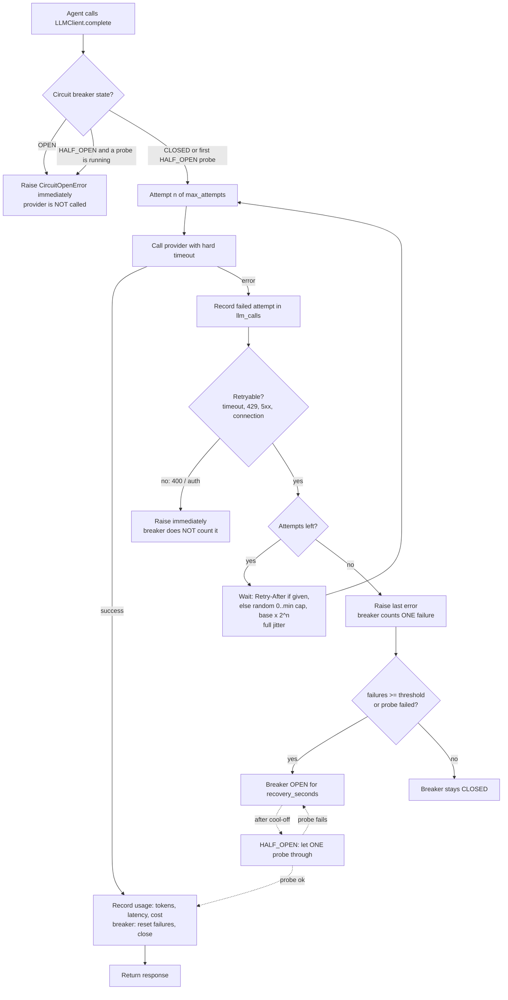
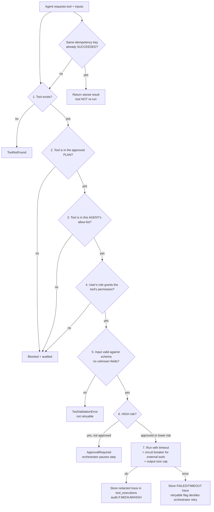

# Flowchart: LLM call protection (timeout, retry, circuit breaker)

```mermaid
flowchart TD
    A[Agent calls LLMClient.complete] --> B{Circuit breaker state?}
    B -- OPEN --> X[Raise CircuitOpenError immediately<br/>provider is NOT called]
    B -- HALF_OPEN and a probe is running --> X
    B -- CLOSED or first HALF_OPEN probe --> C[Attempt n of max_attempts]
    C --> D[Call provider with hard timeout]
    D -- success --> E[Record usage: tokens, latency, cost<br/>breaker: reset failures, close]
    E --> Z[Return response]
    D -- error --> F[Record failed attempt in llm_calls]
    F --> G{Retryable?<br/>timeout, 429, 5xx, connection}
    G -- no: 400 / auth --> H[Raise immediately<br/>breaker does NOT count it]
    G -- yes --> I{Attempts left?}
    I -- yes --> J[Wait: Retry-After if given,<br/>else random 0..min cap, base x 2^n<br/>full jitter] --> C
    I -- no --> K[Raise last error<br/>breaker counts ONE failure]
    K --> L{failures >= threshold<br/>or probe failed?}
    L -- yes --> M[Breaker OPEN for recovery_seconds]
    L -- no --> N[Breaker stays CLOSED]
    M -. after cool-off .-> O[HALF_OPEN: let ONE probe through]
    O -. probe ok .-> E
    O -. probe fails .-> M
```

# Flowchart: the seven gates every tool call passes

```mermaid
flowchart TD
    S[Agent requests tool + inputs] --> G1{1. Tool exists?}
    G1 -- no --> R1[ToolNotFound]
    G1 -- yes --> G2{2. Tool is in the approved PLAN?}
    G2 -- no --> R2[Blocked + audited]
    G2 -- yes --> G3{3. Tool is in this AGENT's allow-list?}
    G3 -- no --> R2
    G3 -- yes --> G4{4. User's role grants the tool's permission?}
    G4 -- no --> R2
    G4 -- yes --> G5{5. Input valid against schema<br/>no unknown fields?}
    G5 -- no --> R3[ToolValidationError<br/>not retryable]
    G5 -- yes --> G6{6. HIGH risk?}
    G6 -- yes, not approved --> R4[ApprovalRequired<br/>orchestrator pauses step]
    G6 -- approved or lower risk --> G7[7. Run with timeout<br/>+ circuit breaker for external tools<br/>+ output size cap]
    G7 -- ok --> OK[Store redacted trace in tool_executions<br/>audit if MEDIUM/HIGH]
    G7 -- error --> ER[Store FAILED/TIMEOUT trace<br/>retryable flag decides orchestrator retry]
    S --> RP{Same idempotency key<br/>already SUCCEEDED?}
    RP -- yes --> RS[Return stored result<br/>tool NOT re-run]
    RP -- no --> G1
```
