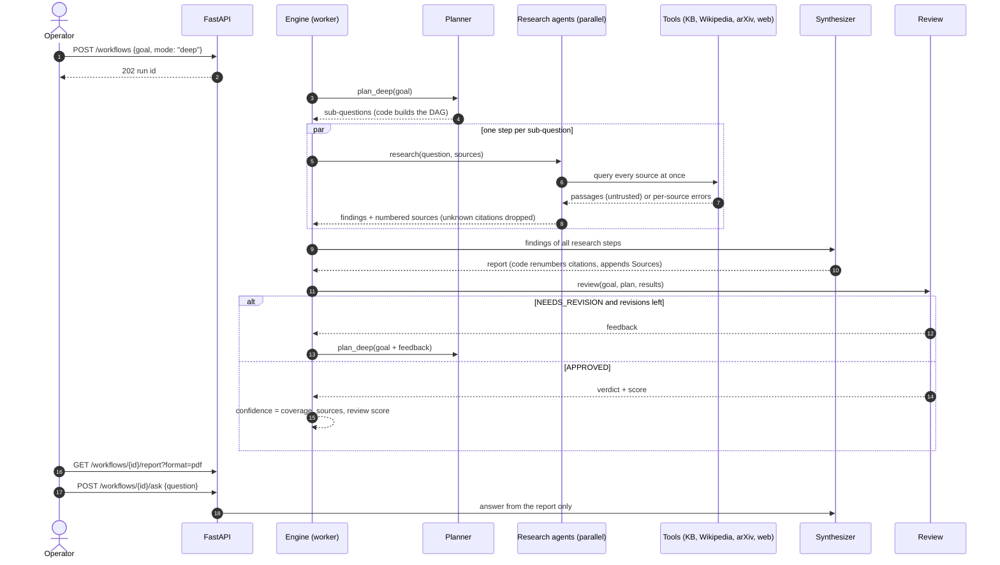

# Sequence: deep research run

```mermaid
sequenceDiagram
    autonumber
    actor U as Operator
    participant API as FastAPI
    participant E as Engine (worker)
    participant P as Planner
    participant R as Research agents (parallel)
    participant T as Tools (KB, Wikipedia, arXiv, web)
    participant S as Synthesizer
    participant V as Review
    U->>API: POST /workflows {goal, mode: "deep"}
    API-->>U: 202 run id
    E->>P: plan_deep(goal)
    P-->>E: sub-questions (code builds the DAG)
    par one step per sub-question
        E->>R: research(question, sources)
        R->>T: query every source at once
        T-->>R: passages (untrusted) or per-source errors
        R-->>E: findings + numbered sources (unknown citations dropped)
    end
    E->>S: findings of all research steps
    S-->>E: report (code renumbers citations, appends Sources)
    E->>V: review(goal, plan, results)
    alt NEEDS_REVISION and revisions left
        V-->>E: feedback
        E->>P: plan_deep(goal + feedback)
    else APPROVED
        V-->>E: verdict + score
        E-->>E: confidence = coverage, sources, review score
    end
    U->>API: GET /workflows/{id}/report?format=pdf
    U->>API: POST /workflows/{id}/ask {question}
    API->>S: answer from the report only
```
