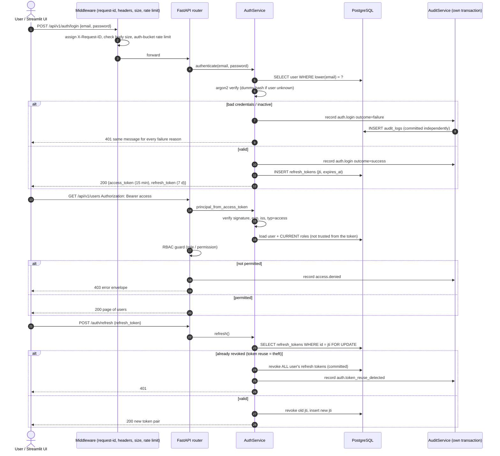

# Sequence: login, authenticated request, refresh rotation

```mermaid
sequenceDiagram
    autonumber
    actor U as User / Streamlit UI
    participant MW as Middleware (request-id, headers, size, rate limit)
    participant API as FastAPI router
    participant AS as AuthService
    participant DB as PostgreSQL
    participant AU as AuditService (own transaction)

    U->>MW: POST /api/v1/auth/login {email, password}
    MW->>MW: assign X-Request-ID, check body size, auth-bucket rate limit
    MW->>API: forward
    API->>AS: authenticate(email, password)
    AS->>DB: SELECT user WHERE lower(email) = ?
    AS->>AS: argon2 verify (dummy hash if user unknown)
    alt bad credentials / inactive
        AS->>AU: record auth.login outcome=failure
        AU->>DB: INSERT audit_logs (committed independently)
        AS-->>U: 401 same message for every failure reason
    else valid
        AS->>AU: record auth.login outcome=success
        AS->>DB: INSERT refresh_tokens (jti, expires_at)
        AS-->>U: 200 {access_token (15 min), refresh_token (7 d)}
    end

    U->>API: GET /api/v1/users  Authorization: Bearer access
    API->>AS: principal_from_access_token
    AS->>AS: verify signature, exp, iss, typ=access
    AS->>DB: load user + CURRENT roles (not trusted from the token)
    API->>API: RBAC guard (role / permission)
    alt not permitted
        API->>AU: record access.denied
        API-->>U: 403 error envelope
    else permitted
        API-->>U: 200 page of users
    end

    U->>API: POST /auth/refresh {refresh_token}
    API->>AS: refresh()
    AS->>DB: SELECT refresh_tokens WHERE id = jti FOR UPDATE
    alt already revoked (token reuse = theft)
        AS->>DB: revoke ALL user's refresh tokens (committed)
        AS->>AU: record auth.token_reuse_detected
        AS-->>U: 401
    else valid
        AS->>DB: revoke old jti, insert new jti
        AS-->>U: 200 new token pair
    end
```
