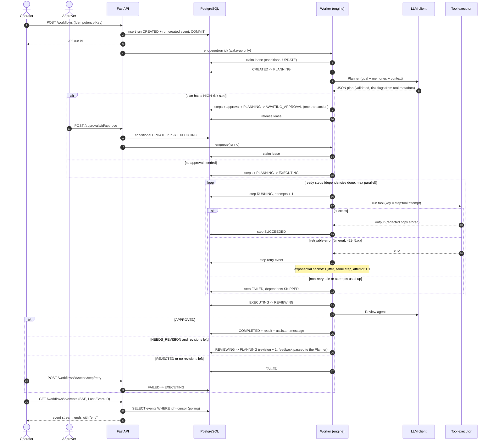
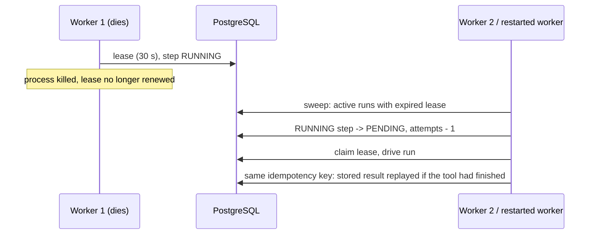

# Sequence: create workflow -> plan -> approval -> execute -> review (with retry and failure)

```mermaid
sequenceDiagram
    autonumber
    actor Op as Operator
    actor Ap as Approver
    participant API as FastAPI
    participant DB as PostgreSQL
    participant W as Worker (engine)
    participant LLM as LLM client
    participant T as Tool executor

    Op->>API: POST /workflows (Idempotency-Key)
    API->>DB: insert run CREATED + run.created event, COMMIT
    API-->>Op: 202 run id
    API->>W: enqueue(run id) (wake-up only)
    W->>DB: claim lease (conditional UPDATE)
    W->>DB: CREATED -> PLANNING
    W->>LLM: Planner (goal + memories + context)
    LLM-->>W: JSON plan (validated, risk flags from tool metadata)
    alt plan has a HIGH-risk step
        W->>DB: steps + approval + PLANNING -> AWAITING_APPROVAL (one transaction)
        W->>DB: release lease
        Ap->>API: POST /approvals/id/approve
        API->>DB: conditional UPDATE, run -> EXECUTING
        API->>W: enqueue(run id)
        W->>DB: claim lease
    else no approval needed
        W->>DB: steps + PLANNING -> EXECUTING
    end
    loop ready steps (dependencies done, max parallel)
        W->>DB: step RUNNING, attempts + 1
        W->>T: run tool (key = step:tool:attempt)
        alt success
            T-->>W: output (redacted copy stored)
            W->>DB: step SUCCEEDED
        else retryable error (timeout, 429, 5xx)
            T-->>W: error
            W->>DB: step.retry event
            Note over W: exponential backoff + jitter, same step, attempt + 1
        else non-retryable or attempts used up
            W->>DB: step FAILED, dependents SKIPPED
        end
    end
    W->>DB: EXECUTING -> REVIEWING
    W->>LLM: Review agent
    alt APPROVED
        W->>DB: COMPLETED + result + assistant message
    else NEEDS_REVISION and revisions left
        W->>DB: REVIEWING -> PLANNING (revision + 1, feedback passed to the Planner)
    else REJECTED or no revisions left
        W->>DB: FAILED
        Op->>API: POST /workflows/id/steps/step/retry
        API->>DB: FAILED -> EXECUTING
    end
    Op->>API: GET /workflows/id/events (SSE, Last-Event-ID)
    API->>DB: SELECT events WHERE id > cursor (polling)
    API-->>Op: event stream, ends with "end"
```

## Crash path

```mermaid
sequenceDiagram
    participant W1 as Worker 1 (dies)
    participant DB as PostgreSQL
    participant W2 as Worker 2 / restarted worker
    W1->>DB: lease (30 s), step RUNNING
    Note over W1: process killed, lease no longer renewed
    W2->>DB: sweep: active runs with expired lease
    W2->>DB: RUNNING step -> PENDING, attempts - 1
    W2->>DB: claim lease, drive run
    W2->>DB: same idempotency key: stored result replayed if the tool had finished
```
